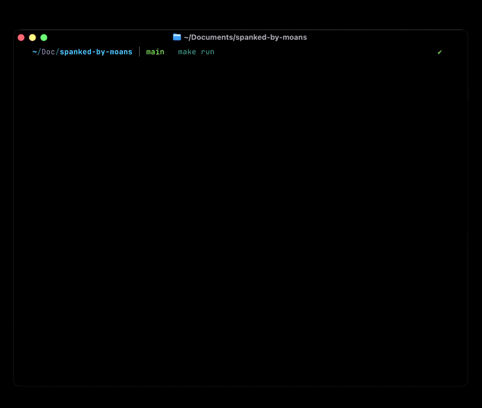

<div align="center">

# 🥵 spanked-by-moans


Inspired by [SlapMac](https://slapmac.com/).



</div>

---

## How it works

Compares the RMS² energy of each audio block against a slow-moving background average. A physical slap typically spikes 20–100× above ambient noise. A 0.8s cooldown prevents double-counting.

---

## Requirements

### macOS

- Python 3.11–3.13
- [Poetry](https://python-poetry.org/docs/#installation)

> PortAudio is bundled inside the `sounddevice` wheel on macOS — no system install needed.

### Linux

- Python 3.11–3.13
- [Poetry](https://python-poetry.org/docs/#installation)
- PortAudio (system library):

```bash
sudo apt install libportaudio2
```

---

## Sensitivity

Adjustable from the tray / menu bar:

| Level | Trigger ratio | Best for |
|-------|--------------|----------|
| Low | 200× background | Hard slaps only |
| Medium *(default)* | 100× background | Normal use |
| High | 50× background | Light taps |

---

## Custom sounds

Drop `.mp3` or `.wav` files into the `sounds/` directory. The app shuffles them randomly, never playing the same file twice in a row. **MP3 is recommended** — same quality, ~10× smaller files.

